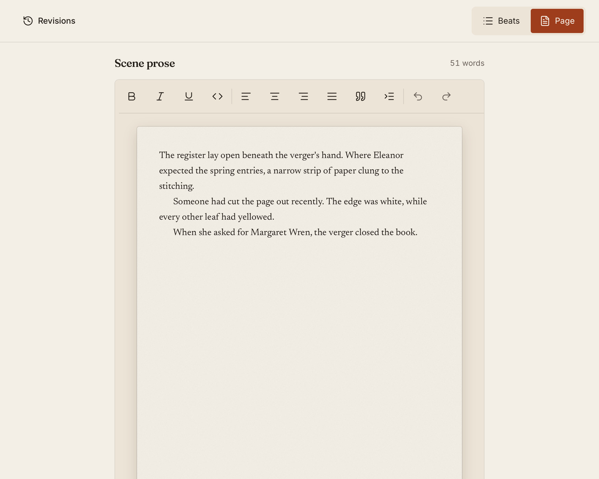

kindling v1.3 has a new look and new ways to share your writing. Meet **Press**, our editorial design for the app and website, exchange manuscript feedback, and prepare custom exports for your next reader. Daily writing goals, customizable shortcuts, and one Settings window round out the release.

## Meet Press

Open kindling and the change is immediate: warm paper surfaces, bookish headings, and a writing space that feels at home with a manuscript.

Press gives the app and website one visual language. Newsreader carries your prose, Fraunces shapes the headings, and Inter keeps controls clear. Fine rules separate sections, with terracotta marking actions and selections. In the app, both light and dark themes share the same care for reading.

The aim is a comfortable place to spend time with your story, from the first beat to the next revision.

A theme-matched loading screen carries that design through startup. It respects reduced-motion preferences and clears as soon as the interface is ready, without adding a timed delay.

## Bring your editor into the manuscript

Choose **File → Editorial Review** to send your whole manuscript or selected chapters as a `.kindling-review` file. Add a brief, name the round, and share the file however you prefer. Both you and your editor use kindling. The review itself needs no account or internet connection.

Your editor can read and edit normally. Typing, deleting, pasting, and formatting become tracked suggestions. Comments support replies, resolution, and reopening. **Simple markup** keeps the prose readable with indicators in the margin; **All markup** shows the pending insertions and deletions.

The start screen’s **Open Review Package** action opens review and feedback files. When a `.kindling-feedback` file comes back, importing it adds the feedback to your project. You decide which suggestions to accept or reject. If you have rewritten a passage while the review was out, kindling lets you compare the original, your current prose, and the suggestion before applying it to the passage you choose.

You can also use **Revisions** for your own editing pass, without exchanging files. Suggest changes, discuss a passage, or compare saved drafts while your outline remains beside the manuscript.

[Read the editorial review guide](/docs/editorial-review/).

## An export for each reader

An agent's submission requirements, your writing group's reading copy, and chapters
for your website each call for different settings. The new **Custom export workspace**
lets you save a profile for each, with your chapter selection, typography, and book details.

Choose **File → Export → Custom** and start with **Agent submission**, **Writing group**,
or **Website chapters**. Adjust settings beside a manuscript preview, then reuse your
profile next time. Word offers page layout and running headers; EPUB includes book
metadata and an optional cover. HTML and plain-text manuscript exports are new, too.

**The simple exports are still there.** Choose Word, ePub, Markdown, or another
standard format directly when you just need a file. Custom is optional, and changing
export settings leaves your writing in kindling unchanged.

[Explore the export workspace](/docs/export-workspace/).

## See the work you put in

Word counts now follow you through the manuscript: scene, chapter, project, and session totals stay visible in the status bar, even with the sidebar closed. Open **Writing statistics** for a chapter breakdown, scenes with prose, empty scenes, and average scene length.

Set a daily goal for each project and follow your progress in the sidebar. The default is 500 words; set it to zero if a daily target does not help your writing. Streaks count consecutive days when you meet your goal.

Daily and session totals count net words added through saved edits. Add 300 words and cut 100, and your total is 200. Imports, duplicated scenes, restored drafts, and accepted editorial suggestions do not earn writing credit. Your manuscript can get better on a day when the number goes down.

[Learn about goals, sessions, and statistics](/docs/writing-progress/).

## Pick up the thread

Open a scene and **Previously** shows the preceding scene's title, synopsis, and last three sentences. It follows manuscript order across chapters and reads the prose from the active Beat or Page view. Collapse it when you want more room; kindling remembers your preference.

kindling also remembers where you were working in each project: the scene, expanded beat, cursor, and scroll position. Return after a break and carry on from the same place.

## Make a change across the draft

Renamed a character halfway through a book? **Find and Replace in Project** lets you search across your prose, match case or whole words, and replace one occurrence or all editable matches. You can narrow the search to a scene and jump straight to a passage from the results.

Replacements preserve formatting outside the match and skip locked scenes and chapters. **Undo replacement** is available while the dialog stays open.

[See search scope and shortcuts](/docs/scene-workflow/#find-and-replace).

## Take your story world into the next book

Choose **Copy references from project…** to bring characters, locations, and other references into another project. Review your selection before copying, including descriptions, notes, custom fields, and tags.

Possible duplicates are skipped by default. Choose **Keep both** when you want a separate version. Existing references are never overwritten, and each copy can evolve with its book: changes in one project do not update another.

[Learn how reference copying works](/docs/references/#copying-references-between-projects).

## Bring novelWriter with you

novelWriter joins the supported import formats. Select the project folder to bring in chapters, scenes, prose, synopses, beat comments, and reference notes. You can export a novelWriter project too, for use with novelWriter 26.2 or newer.

For projects linked to a novelWriter source, Sync lets you compare incoming prose with your current draft and choose which changes to accept. Prose changes start unselected. Export to a new empty folder when you want to take kindling changes back to novelWriter.

[Read the novelWriter workflow](/docs/importing-projects/#novelwriter-project-folder).

## One place for settings

The new **Settings** window gathers appearance, shortcuts, author details, project preferences, reference types, tags, and custom fields into one place. Open it from the project sidebar footer, **File → Settings…**, or the command palette. Its sidebar project selector lets you configure another book while keeping your current manuscript open.

Draft changes stay with you as you move between settings areas. Before switching projects or closing the window with unsaved changes, kindling asks whether to discard them or keep editing.

[Explore Settings](/docs/settings/).

## Shortcuts that fit your hands

Remap kindling commands and prose formatting in **Settings → Keyboard Shortcuts**. Find a command, select its binding, and press your preferred combination. Menus, the command palette, and shortcut hints update immediately, and your choices stay across launches.

Conflicts tell you which command already uses the keys. Clear a binding to free it up, or reset everything to the defaults. Familiar text editing and system keys keep their usual jobs.

[Customize your shortcuts](/docs/settings/#keyboard-shortcuts).

## More care around saving

Autosave keeps your editing focus in place. Failed drafts stay available with retry and discard choices, and kindling saves pending prose, synopses, and writing position before quitting or applying an update. Update and relaunch failures now show an error you can act on.

Cancelling quit after a save failure returns you to your writing selection. New project snapshots keep independent files, so deleting one leaves the others intact. Manuscript exports use the active writing view once, leaving out cached prose from the other view.

You can also report a problem or request a feature through **Help → Send Feedback…**. Submitting feedback sends the form over the internet. Your writing and editorial review stay local, and the desktop app has no analytics or telemetry.

On Linux, this release includes an attempted workaround for the reported white window at startup. It remains unverified against that report; see [troubleshooting](/docs/troubleshooting/#linux-white-window-on-startup) if you encounter it.

kindling remains free and open source, with no account required. When you're ready for another pair of eyes, your manuscript can make that trip as a file.
